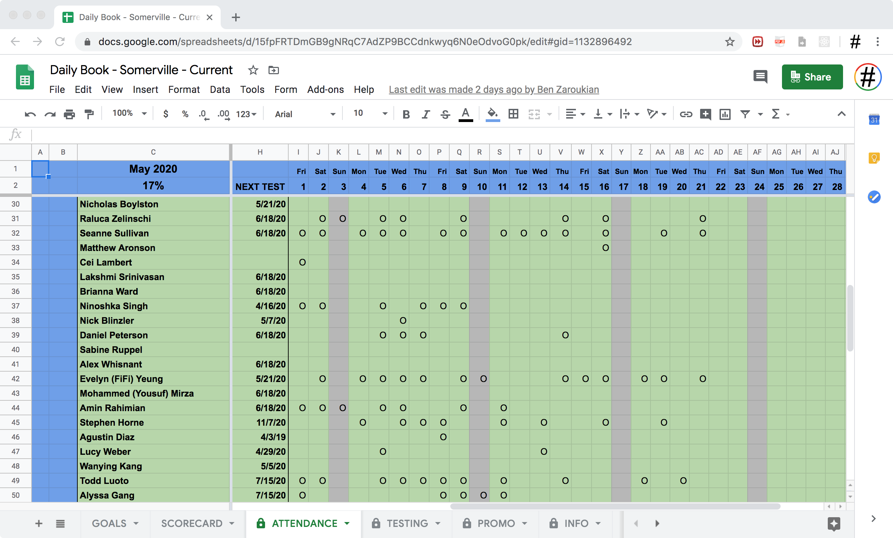
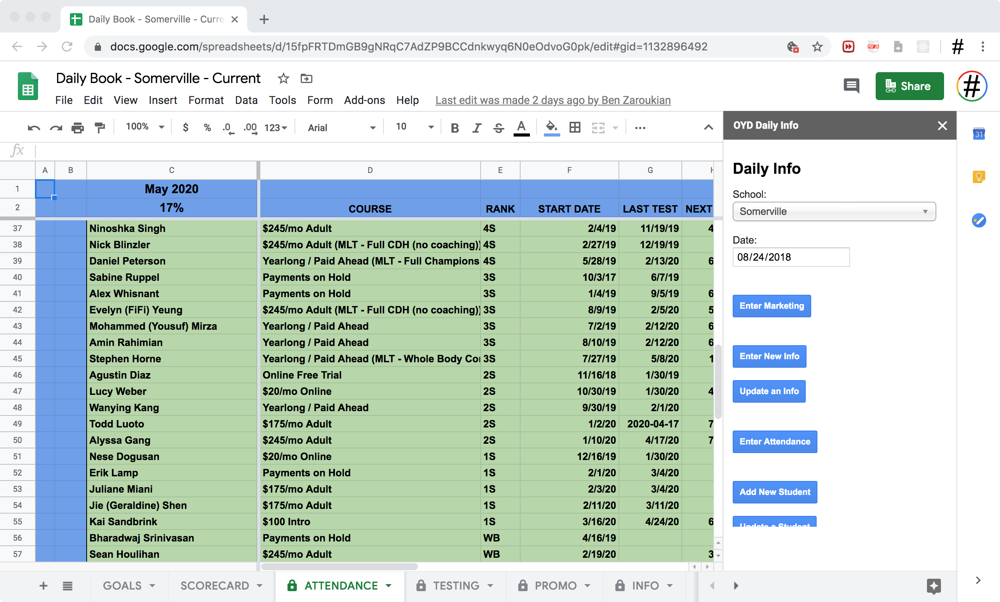
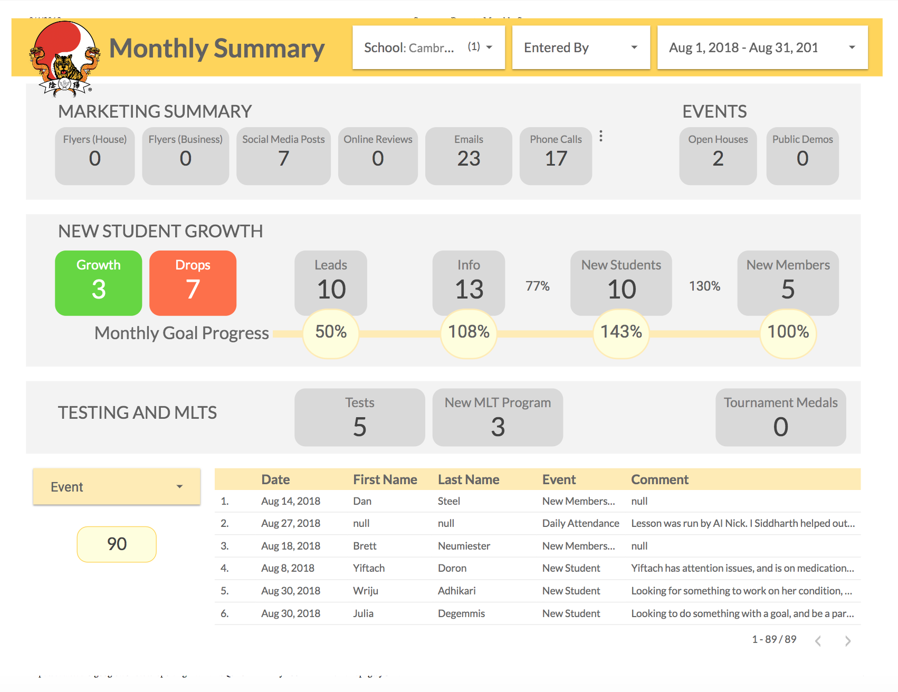
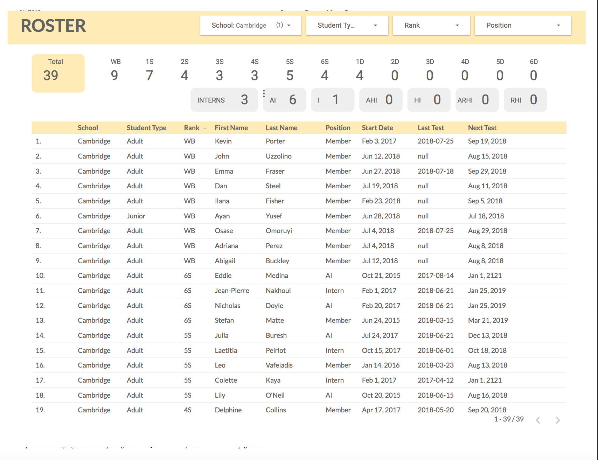
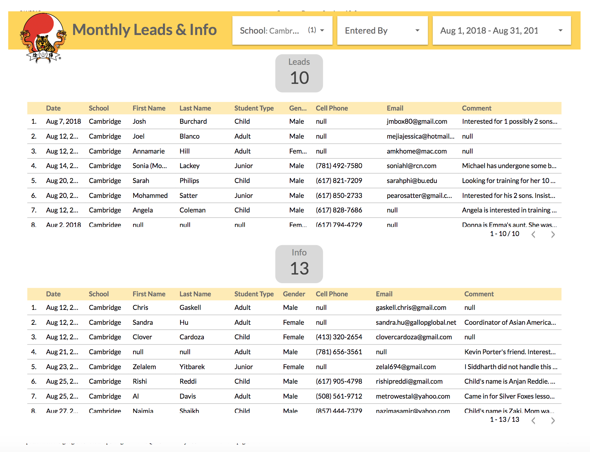
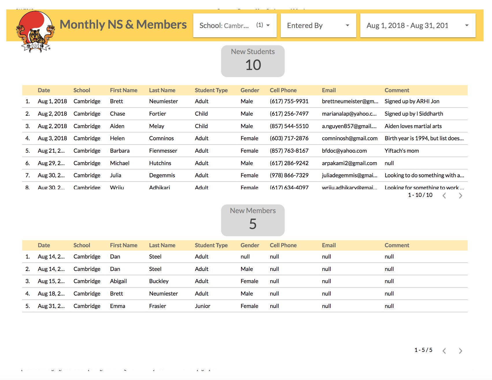

# DailyData API v1

## Table of Contents
1. [Overview](#overview)
2. [API Reference](#api-reference)

## Overview

The DailyData API is meant to work with a prototype of the OYD Daily platform implemented in Google Sheets + Google Apps Script. Data is fetched via the DailyData API when the sheet is accessed.

The sheet has some html widgets for input.

These widgets trigger calls to the DailyData API, updating the database and subsequently refreshing the google sheet.

The data from the database is processed using Google DataStudio to generate reports like so:
1. A monthly master report

2. A belt line analysis

3. Summary of new leads and infos

4. Summary of new students and memberships

5. Summary of drops, seminars, and more...

## API Reference

For full API reference, visit: https://docs.google.com/document/d/1Ey0dwSSJo8eAHtKv2_FbaoluwQFkvu2gPz2BOiXn80g/edit?usp=sharing

